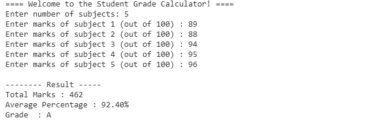

# Task 2 - Student Grade Calculator

## Description

A Java program to calculate total marks, average percentage, and grade.

## Features

- Input Marks
- Calculate Total
- Calculate Percentage
- Display Grade
- Input Validation

## Language

Java

## Output

